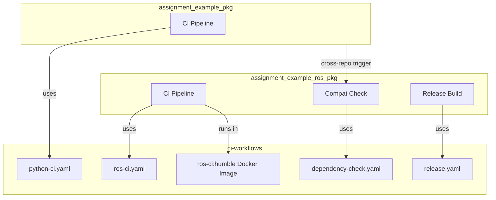

# ci-workflows

Shared CI infrastructure for the `calebjakemossey` organisation. Provides reusable GitHub Actions workflows and a pre-built Docker image for ROS2 CI pipelines.

[](https://github.com/calebjakemossey/ci-workflows/actions/workflows/build-ci-image.yaml)

## Architecture



## Reusable Workflows

| Workflow | File | Purpose | Key Inputs |
|----------|------|---------|------------|
| **Python CI** | `python-ci.yaml` | Lint and test Python packages | `python-versions`, `test-command`, `lint` |
| **ROS CI** | `ros-ci.yaml` | Lint, build, and test ROS2 packages | `ros-distro`, `repos-file`, `container-image` |
| **Dependency Check** | `dependency-check.yaml` | Verify compatibility with upstream repos | `upstream-repo`, `upstream-ref`, `ros-distro` |
| **Release** | `release.yaml` | Build variant Docker images on release | `variants`, `image-name`, `ros-distro` |

### Usage example

```yaml
# In your repo's .github/workflows/ci.yaml
name: CI
on: [push, pull_request]

jobs:
  ci:
    uses: calebjakemossey/ci-workflows/.github/workflows/ros-ci.yaml@v1
    with:
      ros-distro: humble
```

## Docker Image

The `ros-ci:humble` image is built from the `Dockerfile` in this repo and published to GHCR.

**Pull it:**
```bash
docker pull ghcr.io/calebjakemossey/ros-ci:humble
```

**What's installed:**
- Base: `ros:humble`
- `python3-vcstool` - multi-repo workspace management
- `python3-colcon-common-extensions` - ROS2 build tool
- `python3-rosdep` - dependency resolution (initialised)
- `pytest` - Python test runner

The image is rebuilt automatically when the `Dockerfile` changes on `main`.

## Deliverable Documents

- [CI/CD Architecture Document](https://github.com/calebjakemossey/ci-workflows/wiki/CI-CD-Architecture) *(placeholder)*
- [Pipeline Specification](https://github.com/calebjakemossey/ci-workflows/wiki/Pipeline-Specification) *(placeholder)*

## Divergences from Assignment Requirements

The following decisions differ from the original assignment brief, with reasoning:

| Requirement | Implementation | Reasoning |
|-------------|---------------|-----------|
| Private repositories | **Public** | GitHub's free plan does not support branch protection rules on private repos. Public repos allow us to enforce CI status checks and demonstrate the full PR workflow. In production, these would be private with a paid GitHub plan. |
| ROS2 Iron | **ROS2 Humble** | The starter code referenced Iron, which reached end-of-life in December 2024 and no longer receives updates or security patches. Humble is the current LTS distribution (supported until May 2027). |
| Required PR approvals | **CI checks only** | A solo developer cannot approve their own PRs on GitHub. Branch protection requires CI status checks to pass. The review process is documented in CODEOWNERS and CONTRIBUTING.md for team use. |

## Contributing

See [CONTRIBUTING.md](CONTRIBUTING.md) for guidelines on modifying workflows and testing changes.
