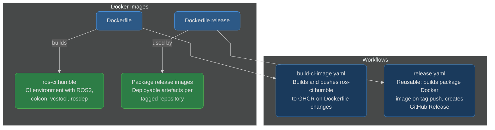

# ci-workflows

Shared CI/CD infrastructure for the robotics demo project. Provides Docker images for ROS2 CI environments and a reusable release workflow for building deployable artefacts.

[](https://github.com/calebjakemossey/ci-workflows/actions/workflows/build-ci-image.yaml)

## What This Repo Provides



## Docker Images

### `ros-ci:humble` - CI Environment

Used by application repos as the container for building and testing ROS2 packages.

```bash
docker pull ghcr.io/calebjakemossey/ros-ci:humble
```

**Contents:**
- Base: `ros:humble` (Ubuntu 22.04)
- `python3-vcstool` - multi-repo workspace management
- `python3-colcon-common-extensions` - ROS2 build tool
- `python3-rosdep` - dependency resolution (initialised)
- `pytest` - Python test runner

Rebuilt automatically when the `Dockerfile` changes on `main` via [build-ci-image.yaml](.github/workflows/build-ci-image.yaml).

### `Dockerfile.release` - Generic Release Image

Used by the [release.yaml](.github/workflows/release.yaml) workflow to build deployable images for individual packages. Application repos provide their source code - this Dockerfile handles dependency fetching and building. The same Dockerfile works across all ROS2 repos, avoiding duplication.

## Workflows

### `build-ci-image.yaml`

Builds the `ros-ci:humble` Docker image and pushes it to GHCR. Triggers when the `Dockerfile` changes on `main` or via manual dispatch.

See [build-ci-image.yaml](.github/workflows/build-ci-image.yaml).

### `release.yaml` (reusable)

Reusable workflow that builds a Docker image for a package and creates a GitHub Release. Called by application repos when they push a version tag. Uses `Dockerfile.release` from this repo with the calling repo's source as build context.

| Input | Type | Default | Description |
|-------|------|---------|-------------|
| `ros-distro` | string | `humble` | ROS2 distribution |
| `registry` | string | `ghcr.io/<owner>` | Container registry prefix |
| `image-name` | string | required | Image name (e.g., `assignment-example-ros-pkg`) |

**Caller example:**
```yaml
jobs:
  release:
    uses: calebjakemossey/ci-workflows/.github/workflows/release.yaml@v1
    with:
      image-name: assignment-example-ros-pkg
      ros-distro: humble
    secrets:
      registry-token: ${{ secrets.GITHUB_TOKEN }}
```

See [release.yaml](.github/workflows/release.yaml).

## Contributing

See [CONTRIBUTING.md](CONTRIBUTING.md) for guidelines on modifying workflows and testing changes.
